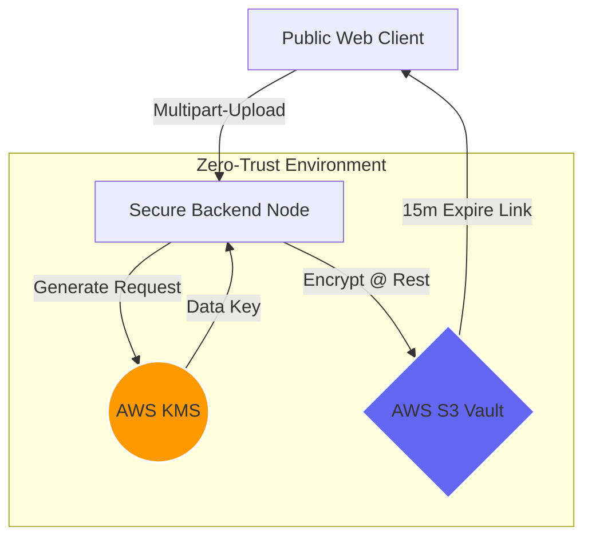

<p align="center">
  
</p>

<h3 align="center"><font color="#ef4444">Military-Grade Encryption • Zero-Trust Access • High Performance</font></h3>

<p align="center">
  
  
  
  
  
</p>

<p align="center">
  
  
  
  
  
</p>

<p align="center">
  <b><a href="#quick-start-deployment">Quick Start</a> &nbsp;·&nbsp;
  <a href="https://github.com/pendalwarmadhukar/CloudShield">Repository</a> &nbsp;·&nbsp;
  <a href="https://github.com/pendalwarmadhukar/CloudShield/issues">Report Bug</a> &nbsp;·&nbsp;
  <a href="https://github.com/pendalwarmadhukar/CloudShield/issues">Request Feature</a></b>
</p>

---

## 👨💻 Project Infrastructure

<table align="center">
  <tr>
    <td width="50%" valign="top">
      <h3>🛡️ Security Protocols</h3>
      <ul>
        <li><b>Algorithm:</b> AES-256-GCM (Hardware-Backed)</li>
        <li><b>Keys:</b> Symmetric Multi-Region AWS KMS</li>
        <li><b>Access:</b> IAM Policy (Strictly Scoped)</li>
        <li><b>Transport:</b> TLS 1.3 / S3 Pre-signed URLs</li>
      </ul>
    </td>
    <td width="50%" valign="top">
      <h3>🏗️ Tech Stack</h3>
      <ul>
        <li><b>Frontend:</b> React 19 + Framer Motion</li>
        <li><b>Backend:</b> Node.js + Express + Multer</li>
        <li><b>Cloud:</b> AWS S3 & AWS KMS (SDK v3)</li>
        <li><b>Database:</b> MongoDB Atlas (Mongoose)</li>
      </ul>
    </td>
  </tr>
</table>

### 🔒 Core Cybersecurity Architecture



---

## ⚡ Quick Start Deployment

### 🧪 Cyber-Security Sandbox (Mock Mode)
Test the full logic without active AWS credentials.
```bash
# Set MOCK_AWS=true in .env
cd backend && npm start
cd frontend && npm run dev
```

### 🛡️ Production Hardening
```env
MOCK_AWS=false
AWS_REGION=us-east-1
S3_BUCKET_NAME=your-private-vault
KMS_KEY_ID=your-fips-140-key
```

---

## 🔗 Related Projects
- **[Outpass System (PassPortal)](https://github.com/pendalwarmadhukar/outpass)**: A secure college leave management system with a focus on digitized permissions and campus security.

---
<p align="center">
  © 2026 <b>CloudShield Security Labs</b>. Protected by <b>AWS Identity and Access Management</b>.
</p>
